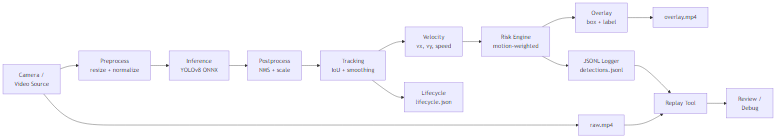
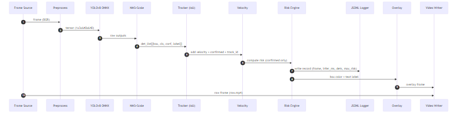

# BOREALIS V1 — System Architecture
**Canadian Sovereign Edge AI Intelligence System**

---

## Executive Summary

BOREALIS is a CPU-validated computer vision pipeline designed for Arctic sovereignty operations. The system provides real-time threat detection and risk assessment with complete audit trails, operating without cloud dependencies or constant connectivity.

**Status:** Phase-1 complete (CPU baseline validated)  
**Performance:** ~7-8 FPS on CPU, ~130-150ms inference latency  
**Next Phase:** Jetson Orin Nano migration (2-3× performance target)

---


---

## Visual Documentation

**Architecture diagram:**  
  
*[Source: ARCHITECTURE.mmd](diagrams/ARCHITECTURE.mmd)*

**Data flow diagram:**  
  
*[Source: DATA_FLOW.mmd](diagrams/DATA_FLOW.mmd)*

> **Viewing Mermaid diagrams:**
> - GitHub: Renders automatically in markdown preview
> - VS Code: Install "Markdown Preview Mermaid Support" extension
> - Export PNG: Paste into https://mermaid.live → Download PNG for slides

---
## System Overview
```
┌─────────────────────────────────────────────────────────────┐
│                    BOREALIS V1 Pipeline                      │
├─────────────────────────────────────────────────────────────┤
│                                                              │
│  Camera Input (CV2)                                          │
│       ↓                                                      │
│  YOLOv8n ONNX Inference (640×640)                           │
│       ↓                                                      │
│  NMS Post-processing (confidence + IoU filtering)            │
│       ↓                                                      │
│  IoU Tracker (persistent IDs, velocity estimation)           │
│       ↓                                                      │
│  Motion-Weighted Risk Assessment                             │
│    • Forward sector geometry                                 │
│    • Distance proxy (box size)                               │
│    • Velocity magnitude                                      │
│    • Heading analysis (approach detection)                   │
│    • Persistence tracking (sustained threat escalation)      │
│       ↓                                                      │
│  Defense-Grade Logging                                       │
│    • JSONL frame-by-frame detections                         │
│    • Raw video (sensor truth)                                │
│    • Overlay video (disposable UI)                           │
│    • Lifecycle events (track birth/death)                    │
│    • Metadata (full config capture)                          │
│       ↓                                                      │
│  JSON-First Replay Tool                                      │
│                                                              │
└─────────────────────────────────────────────────────────────┘
```

---

## Core Modules

### 1. Detection Engine
- **Model:** YOLOv8n (ONNX format)
- **Input:** 640×640 RGB frames
- **Output:** Bounding boxes (x1,y1,x2,y2), confidence, class
- **Post-processing:** NMS (IoU threshold 0.45, confidence threshold 0.35)
- **Classes:** COCO80 (current), Arctic-specific classes (planned)

### 2. Tracking System (`borealis_tracker_v3.py`)
- **Algorithm:** IoU-based greedy matching
- **Features:**
  - EMA box smoothing (alpha=0.7)
  - Confirmed tracks (min 2 hits)
  - 30-frame occlusion grace period
  - Velocity estimation (5-frame history)
  - Persistence tracking for risk escalation
- **Output:** track_id, velocity (vx, vy, speed), persistence_count

### 3. Risk Assessment (`borealis_risk_v2.py`)
- **Motion-Weighted Scoring:**
  - Forward sector: 25% weight (60% center strip)
  - Distance proxy: 25% weight (box area → range estimate)
  - Confidence: 15% weight
  - Velocity: 20% weight (speed-based escalation)
  - Heading: 15% weight (approach detection)
  - Persistence escalation: +0.2 max for sustained threats
- **States:** SAFE / CAUTION / UNSAFE (color-coded)
- **Thresholds:** UNSAFE ≥0.7, CAUTION ≥0.4

### 4. Logging Infrastructure
- **JSONL:** Frame-by-frame detections with full metadata
- **Raw video:** Unmodified sensor data (mp4v codec, 30 FPS)
- **Overlay video:** Annotated frames for quick review
- **Lifecycle logs:** Track statistics (birth, death, velocity, persistence)
- **Metadata:** Run configuration, timestamps, performance stats

### 5. Replay System (`borealis_v1_replay_json.py`)
- **Source of truth:** Raw video + JSONL detections
- **Features:** Pause/resume, speed control, risk-colored visualization
- **Integrity:** Frame hash verification (optional)

---

## Data Flow
```
Frame N → Inference → Detections → Tracker → Risk → Log
   │                                  ↓              ↓
   └─→ raw.mp4                   track_id      JSONL record
                                  velocity      {frame, ts,
                                  persistence    detections,
                                      ↓          risk...}
                                  overlay.mp4
```

---

## Hard Requirements (Arctic Deployment)

✅ **No cloud dependencies** — All processing on-device  
✅ **No constant connectivity** — Offline-capable  
✅ **Harsh conditions** — Fog, snow, low-light, thermal extremes  
✅ **Complete audit trail** — Forensic replay with frame hash verification  
✅ **Sovereignty** — No foreign cloud services or hardware dependencies  

---

## Performance Baseline (CPU - Windows 10)

**Hardware:** Intel i7 (consumer-grade laptop)  
**Model:** YOLOv8n ONNX (CPU provider)

| Metric | Value |
|--------|-------|
| FPS | 7-8 sustained |
| Inference latency | 130-150ms |
| Track stability | Stable across 800+ frames |
| Memory footprint | ~500MB |
| Disk I/O | ~2MB/s (logging + video) |

---

## Arctic Augmentation Pipeline

**Validated:** Proof-of-concept with 7 images → 28 Arctic variants

**Capabilities:**
- Fog overlay (density 0.2-0.8)
- Snow particles (intensity 0.1-0.7)
- Cold color grading (6000-8000K)
- Contrast reduction (whiteout effect)
- Low-light simulation (polar night)

**Presets:** light, moderate, heavy, polar_night

**Production pipeline:** Ready to scale to 1000+ ship images

---

## File Structure
```
borealis/
├── borealis_v1_motion_risk.py    # Main pipeline
├── borealis_tracker_v3.py         # Tracking + velocity + persistence
├── borealis_risk_v2.py            # Motion-weighted risk assessment
├── borealis_v1_replay_json.py    # Replay tool
├── arctic_augment.py              # Training data augmentation
├── models/
│   └── yolov8n.onnx               # Detection model
├── runs/
│   └── YYYYMMDD_HHMMSS/           # Timestamped run directories
│       ├── raw.mp4                # Sensor truth
│       ├── overlay.mp4            # Annotated video
│       ├── detections.jsonl       # Frame-by-frame logs
│       ├── lifecycle.json         # Track statistics
│       └── meta.json              # Run configuration
└── datasets/
    ├── maritime_sample/           # Source images
    └── arctic_maritime/           # Augmented Arctic images
```

---

## Roadmap

**Phase 1:** ✅ CPU validation (complete)  
**Phase 2:** ⏳ Jetson Orin Nano migration (pending hardware)  
**Phase 3:** ⏳ Arctic training data acquisition  
**Phase 4:** ⏳ TensorRT optimization (30-35 FPS target)  
**Phase 5:** ⏳ Inference scheduler (power-aware, thermal-aware)  
**Phase 6:** ⏳ Sovereignty evaluation (RK3588 fallback)  

---

## Contact

**Project:** BOREALIS — Canadian Sovereign Edge AI  
**Status:** Phase-1 validated, hardware migration pending  
**Documentation Date:** 2026-02-08


